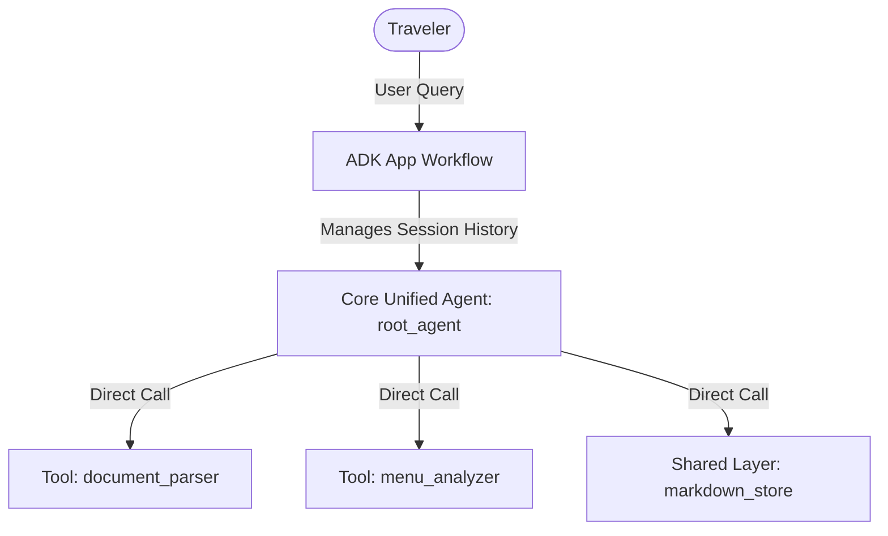

# 🌴 Vacation Copilot — Project Architecture & Configuration Guide

This document explains the codebase layout and walks through the design of **Vacation Copilot**, highlighting how the Google Agent Development Kit (ADK) manages a clean, high-performance **Unified Flat Agent Architecture** using a single core agent and focused Python tools.

---

## 📂 1. Project Directory Structure

The project uses a streamlined layout inside the `app/` folder, separating the core agent instructions, shared data utilities, and atomic tools without the complexity of nested supervisor or sub-agent layers:

```
vacation-copilot/
├── app/
│   ├── __init__.py            # Exports the main FastAPI App
│   ├── agent.py               # Central Unified Agent configuration (root_agent)
│   ├── fast_api_app.py        # FastAPI server wrapping the ADK App runtime
│   ├── shared/                # Code shared across tools and modes
│   │   └── markdown_store.py  # Markdown persistence layer (saves profiles & itineraries)
│   └── tools/                 # Isolated functional Python tools
│       ├── document_parser.py # Parses text/tokens from incoming travel docs
│       └── menu_analyzer.py   # Processes restaurant menus against profile constraints
├── data/                      # Local markdown-based user sandboxes (auto-created)
├── tests/                     # Automated test suites (unit + integration)
├── pyproject.toml             # Project dependencies, lockpins, and tool configurations
└── agents-cli-manifest.yaml   # ADK deployment configurations and manifest targets
```

---

## ⚙️ 2. Walkthrough: `app/agent.py` Configuration

`app/agent.py` is the single entry point for the agent's logic. It instantiates the **Core Unified Agent** (`root_agent`), sets up the primary contextual instruction set, registers all operational tools, and binds the execution loop into the ADK `App`.

Here is the structural breakdown of the configuration:

### A. The Core Unified Instruction & Contextual Modes
Instead of delegating control to sub-agents, the single `CORE_INSTRUCTION` block establishes a robust persona that shifts behavioral modes based on conversation markers:
- **Onboarding Mode**: Activated when the traveler provides dates, accommodations, or text travel documents. The agent updates profile metrics and modifies local Markdown maps.
- **Live Trip Mode**: Activated when the user pastes restaurant menus or asks dining safety questions. The agent cross-references active profile files to run checks.

### B. Instantiating the Unified Agent
```python
root_agent = Agent(
    name="vacation_copilot",
    model="gemini-2.5-flash",
    instruction=CORE_INSTRUCTION,
    description="Unified travel concierge managing pre-trip onboarding and live safety dining matches.",
    tools=[
        parse_travel_document,
        parse_and_match_menu,
        get_itinerary,
        get_user_profile
    ],
    generate_content_config=types.GenerateContentConfig(
        temperature=0.2,
    ),
)
```
- **`model`**: Standardized to modern Gemini execution keys for lightning-fast token evaluation and tool-use precision.
- **`tools`**: Registers all tools in a single flat array. The agent directly decides which tool to execute at any point in the conversation based on the user's intent, completely avoiding multi-agent routing lag.
- **`sub_agents`**: Omitted entirely. The flat architecture maintains a unified context window for cleaner tracking.

### C. Wrapping in the ADK App
```python
app = App(
    root_agent=root_agent,
    name="app",
)
```
The `App` instance encapsulates the core agent, handles multi-turn state lifecycles, and opens up the local execution streams used by the `agents-cli playground` or the web endpoints.

---

## 💾 3. Data Storage & Persistence

Vacation Copilot uses a clean, human-readable **Markdown-First** data storage model managed via `app/shared/markdown_store.py`.

* **Storage Path**: Itineraries, dietary profiles, and parsed menus are written out cleanly to the local `data/` directory.
* **User Isolation**: Files are partitioned by active session or user identification blocks (e.g., `data/{user_id}/profile.md`, `data/{user_id}/itinerary.md`).
* **Environment Configuration**: The data root directory resolves dynamically based on the `VACATION_DATA_DIR` environment variable, ensuring seamless volume mounting when testing locally or running in automated containers.

---

## 🧠 4. Understanding Tools, Nodes, and Workflows in ADK

By utilizing a flat design, Vacation Copilot optimizes the execution path. Traditional complex graphs require multi-agent handshakes; our ADK configuration processes inputs linearly, maximizing prompt execution speed and predictability:



### 1. Simplified Nodes
In this flat model, there are only two types of functional components:
- **The Core Agent Node (`vacation_copilot`)**: The single brain responsible for analyzing the conversation history, maintaining instructions, and making functional text decisions.
- **Tool Nodes**: Pure Python functions registered directly under the agent. These are executed deterministically whenever the agent emits a tool call pattern.

### 2. Elimination of Routing Complexities
- **No Delegation Overhead**: Because sub-agent hierarchies are gone, there are no complex conditional routing states or context swapping failures.
- **Direct Variable Mapping**: The agent reads the user's statement, looks at its flat tool manifest, and triggers the required function directly. Context remains intact across the entire history loop, drastically reducing context loss errors.